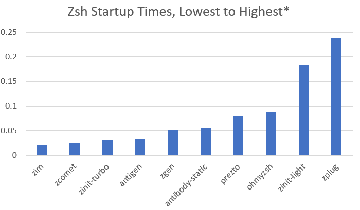

# `zcomet` - Zsh Plugin Manager

<p align="center">
    
</p>

[](https://opensource.org/licenses/MIT)

[](https://github.com/agkozak/zcomet/stargazers)

`zcomet` is a backwards-compatible Zsh plugin manager that gets you to the prompt quickly without having to use a cache. It began as a series of routines that I used in my dotfiles to source plugins and snippets whenever I was using a version of Zsh that was too old for [Zinit](https://github.com/zdharma/zinit). I was pleasantly surprised to find that my code performs impressively in [Zim's framework benchmark test](https://github.com/zimfw/zsh-framework-benchmark).



*\*100 iterations on a four-core Ubuntu laptop*

`zcomet` is still in the initial phases of its development. I have to implement prettier and more informative messages (you will see some raw Git output), and error handling is very basic at present. If I make any changes early on that are likely to break your configuration, I will explain them in the [News](#news) section.

## Table of Contents

- [News](#news)
- [Example `.zshrc`](#example-zshrc)
- [Directory Customization](#directory-customization)
- [Commands and Arguments](#commands-and-arguments)
  + [`load`](#load-repository-name-subdirectory-file1-file2-)
  + [`fpath`](#fpath-repository-name-subdirectory)
  + [`trigger`](#trigger-trigger-name-arguments)
  + [`snippet`](#snippet-snippet)
  + [`update`](#update)
  + [`list`](#list)
  + [`compinit`](#compinit)
  + [`compile`](#compile)
  + [`help`](#help)
  + [`self-update`](#self-update)
  + [`unload`](#unload-repository-name)
- [TODO](#todo)

## News

<!-- <details>
    <summary>Here are the latest features and updates.</summary> -->
- Setpember 16, 2021
    + `zcomet list` now reflects `FPATH` elements added using the `fpath` command.
    + New command: `zcomet compinit` runs `compinit` and compiles its cache for you.
- September 15, 2021
    + `zcomet` will store your plugins and snippets in `${ZDOTDIR}`, if you have set that variable and if `${HOME}/.zcomet` does not already exist. Props to @mattjamesdev.
- September 13, 2021
    + The `snippet` command now supports any URL that points to raw Zsh code (not HTML) via HTTP or HTTPS. It will translate `github.com` addresses into their `raw.githubusercontent.com` equivalents. You may still use the `OMZ::` shorthand for Oh-My-Zsh code.
<!-- </details> -->

## Example `.zshrc`

```sh
# Clone zcomet if necessary
if [[ ! -f ${HOME}/.zcomet/bin/zcomet.zsh ]]; then
  command git clone https://github.com/agkozak/zcomet.git ${HOME}/.zcomet/bin
fi

source ~/.zcomet/bin/zcomet.zsh

# Load a prompt
zcomet load agkozak/agkozak-zsh-prompt

# Load some plugins
zcomet load agkozak/zsh-z
zcomet load ohmyzsh plugins/gitfast

# Load a code snippet
zcomet snippet https://github.com/jreese/zsh-titles/blob/master/titles.plugin.zsh

# Lazyload some plugins
zcomet trigger zhooks agkozak/zhooks
zcomet trigger extract x ohmyzsh plugins/extract
zcomet trigger zsh-prompt-benchmark romkatv/zsh-prompt-benchmark

# Run compinit and compile its cache
zcomet compinit
```

## Directory Customization

`zcomet` will store plugins, snippets, and the like in `~/.zcomet` by default. If you have set `$ZDOTDIR`, then `zcomet` will use `${ZDOTDIR}/.zcomet` instead. You can also specify a custom home directory for `zcomet` thus:

    typeset -A ZCOMET
    ZCOMET[HOME_DIR]=/path/to/zcomet_home_directory
    source /path/to/zcomet.zsh

In the home directory there will usually be a `/repos` subdirectory for plugins and a `/snippets` subdirectory for snippets, but you may use the variables `${ZCOMET[REPOS_DIR]}` and `${ZCOMET[SNIPPETS_DIR]}` to name your own locations.

I recommend cloning the `agkozak/zcomet` repository to a `/bin` subdirectory in your `zcomet` home directory (e.g., `~/.zcomet/bin`), as in the [example `.zshrc`](#example-zshrc) above.

## Commands and Arguments

### `load` repository-name \[subdirectory\] \[file1\] \[file2\] ...

`load` is the most commonly used command; it clones a GitHub repository (if it has not already been downloaded), adds its root directory (or `/functions/` subdirectory, if it exists) to `FPATH`, and sources a file or files. The simplest example is:

    zcomet load agkozak/zsh-z

The common repositories `ohmyzsh/ohmyzsh` and `sorin-ionescu/prezto` can be abbreviated as `ohmyzsh` and `prezto`, respectively. `zcomet` uses simple principles to choose which init file to source (in this case, `/path/to/agkozak/zsh-z/zsh-z.plugin.zsh` is the obvious choice).

A subdirectory of a repository can be specified:

    zcomet load ohmyzsh plugins/gitfast

loads Oh-My-Zsh's useful `gitfast` plugin. If a specific file or files in a subdirectory should be sourced, they can be specified:

    zcomet load ohmyzsh lib git.zsh
    zcomet load sindresorhus/pure async.zsh pure.zsh

Note that autoloadable functions are not automatically autoloaded yet; you will have to do that explicitly for now.

A specific branch, tag, or commit of a repository can be checked out using the following syntax:

    zcomet load author/name@branch

(`@tag` and `@commit` are equally valid.)

`load` is the command used for loading prompts.

### `fpath` repository-name \[subdirectory\]

`fpath` will clone a repository and add one of its directories to `FPATH`. Unlike `load`, it does not source any files. Also, you must be very specific about which subdirectory is to be added to `FPATH`; `zcomet fpath` does not try to guess. If you wanted to use the agkozak-zsh-prompt with `promptinit`, you could run

    zcomet fpath agkozak/agkozak-zsh-prompt
    autoload promptinit; promptinit
    prompt agkozak-zsh-prompt

(But if you are not intending to switch prompts, it is much easier just to use `zcomet load agkozak/agkozak-zsh-prompt`.)

### `trigger` trigger-name \[arguments\]

`trigger` lazyloads plugins, saving time when you start the shell. If you specify a command name, a Git repository, and other optional arguments (the same arguments that get used for `load`), the plugin will be loaded and the command run only when the command is first used:

    zcomet trigger zhooks agkozak/zhooks

for example, creates a function called `zhooks` that loads the `zhooks` plugin and runs the command `zhooks`. It takes next to no time to create the initial function, so this is perfect for commands that you do not instantly and constantly use. If there is more than one command that should trigger the loading of the plugin, you can specify each separately:

    zcomet trigger extract ohmyzsh plugins/extract
    zcomet trigger x ohmyzsh plugins/extract

or save time by listing a number of triggers before the repository name:

    zcomet trigger extract x ohmyzsh plugins/extract

`trigger` was inspired by Zinit's `trigger-load` command.

### `snippet` snippet

`snippet` downloads a script (when necessary) and sources it:

    zcomet snippet OMZ::plugins/git/git.plugins.zsh

This example will download Oh-My-Zsh's `git` aliases without cloning the whole Oh-My-Zsh repository -- a great time-saver.

`zcomet` will translate `github.com` URLs into their raw code `raw.githubusercontent.com` equivalents. For example,

    zcomet snippet https://github.com/jreese/zsh-titles/blob/master/titles.plugin.zsh

really executes

    zcomet snippet https://raw.githubusercontent.com/jreese/zsh-titles/master/titles.plugin.zsh

For snippets that are not hosted by GitHub, you will want to make sure that the URL you use points towards raw code, not a pretty HTML display of it.

### `update`

`zcomet update` downloads updates for any plugins or snippets that have been downloaded in the past and re-`source`s any active plugins or snippets.

### `list`

`zcomet list` displays any active plugins, snippets, and triggers. As you use the triggers, you will see them disappear as triggers and reappear as loaded plugins.

### `compinit`

Runs Zsh's `compinit` command, which is necessary if you want to use command line completions. `compinit`'s cache is then stored in a file in the `$HOME` directory (or in `$ZDOTDIR`, if you have defined it) starting with `.zcompdump_` and ending with the version number of the `zsh` you are using, e.g. `.zcompdump_5.8`. `zcomet` compiles the cache for you.

### `compile`

`zcompile`s a script or scripts if there is no corresponding wordcode (`.zwc`) file or if a script is newer than its `.zwc`. I strongly recommend that you `zcomet compile` whatever `.zcompdump` file your shell is using, as in the example `.zshrc` above -- it will speed up your load time considerably.

### `help`

Displays a simple help screen.

### `self-update`

Updates `zcomet` itself. Note that `zcomet` must have been installed as a cloned Git repository for this to work.

### `unload` \[repository-name\]

Unloads a plugin that has an [unload function](https://github.com/zdharma/Zsh-100-Commits-Club/blob/master/Zsh-Plugin-Standard.adoc#4-unload-function). The implementation is still very basic.

## TODO

* Supply prettier output
* Provide more helpful error messages
* Allow user to update just one repository or snippet
* Improve the `unload` command
* Allow the loading of repositories not on GitHub
* Support for `ssh://` and `git://`
* Allow user to clone `trigger` repositories before they are needed

*Copyright (C) 2021 Alexandros Kozak*
